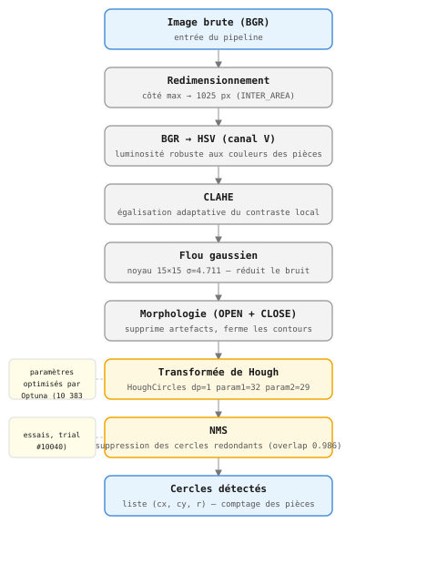

# CoinVision
Système de reconnaissance et denombrement automatique de pièces de monnaie (euro) en utilisant des algorithmes de traitement d'image.

## Description
Ce projet permet de détecter, identifier et compter le nombre de pièces de monnaie à partir d'images, en utilisant des techniques de traitement d'image classiques avec OpenCV. Il est capable de segmenter les pièces, d'extraire leurs caractéristiques visuelles (forme, taille, couleur) et de les compter.

## Technologies

- Python 3.11
- OpenCV — traitement d'image et détection de contours
- NumPy — manipulation des tableaux et calculs numériques

## Structure du projet

```
projet_Image/
├── src/
│   ├── algorithme.py        # Pipeline de traitement : HSV, CLAHE, Hough, NMS, filtres couleur
│   ├── classification.py    # Classification des pièces par couleur et ratio de taille
│   ├── evaluation.py        # Métriques d'évaluation (TP, FP, FN, F1, MSE)
│   └── utiles.py            # Chargement des images et des labels
├── data/
│   ├── base_validation/
│   │   ├── images/          # 150 images de validation (image1.png … image150.png)
│   │   └── labels/          # Annotations JSON (vérité terrain)
│   ├── base_test/
│   │   ├── images/          # 50 images de test (image151.png … image200.png)
│   │   └── labels/          # Annotations JSON (vérité terrain)
│   └── images/              # Images brutes diverses
├── tests/
│   ├── test_class.py        # Debug et évaluation de la classification (base validation)
│   └── test_final.py        # Évaluation finale sur la base de test (à lancer une seule fois)
├── main.py                  # Point d'entrée principal — pipeline de détection
├── optimize.py              # Optimisation des paramètres avec Optuna
├── train.py                 # Script d'entraînement
├── interface.py             # Interface graphique de visualisation
├── coinvision_optuna.db     # Base de données des essais Optuna
├── output.log               # Logs de la dernière exécution
├── result.txt               # Résultats de la dernière exécution
└── README.md
```

## Installation

Cloner le dépôt :

```bash
git clone https://github.com/Sogolon88/PROJET_IMAGE.git
```

Créer un environnement virtuel et installer les dépendances :

```bash
python -m venv venv
source venv/bin/activate  # Windows : venv\Scripts\activate
pip install -r requirements.txt
```

## 🚀 Utilisation

```bash
python main.py
```

## 🔍 Pipeline de traitement

L'algorithme principal (`main.py`) traite chaque image selon les étapes suivantes :

```
Image brute (RGB)
     ↓
Redimensionnement (max 800px)        # mise à l'échelle si nécessaire
     ↓
Conversion BGR → HSV                 # extraction du canal V (luminosité)
     ↓
CLAHE                                # égalisation adaptative du contraste (clipLimit=2.5, tile 8×8)
     ↓
Flou gaussien (11×11, σ=2.5)         # réduction du bruit
     ↓
Morphologie (OPEN + CLOSE)           # suppression du bruit résiduel et fermeture des contours
     ↓
Transformée de Hough (HoughCircles)  # détection des cercles (dp=1, param1=50, param2=60)
     ↓
NMS — Non-Maximum Suppression        # suppression des cercles redondants (overlap > 0.8)
     ↓
Comptage des pièces détectées
     ↓
Évaluation (régression)              # comparaison aux labels de vérité terrain
```


### Détail des étapes

1. **Redimensionnement** — les images dont le côté le plus grand dépasse 800 px sont redimensionnées proportionnellement afin d'uniformiser le traitement.
2. **Espace colorimétrique HSV** — seul le canal V (valeur/luminosité) est utilisé, ce qui rend la détection robuste aux variations de couleur des pièces.
3. **CLAHE** — l'égalisation adaptative du contraste améliore la lisibilité des bords sur les images surexposées ou sous-éclairées.
4. **Flou gaussien** — atténue le bruit haute fréquence avant la détection de cercles.
5. **Morphologie (OPEN + CLOSE)** — l'ouverture supprime les petits artefacts, la fermeture réunit les contours brisés.
6. **Transformée de Hough** — détecte les cercles dans l'image prétraitée. Les rayons acceptés vont de 25 à 140 px, la distance minimale entre deux centres est de 30 px.
7. **NMS (Non-Maximum Suppression)** — filtre les cercles en double en supprimant ceux dont le chevauchement dépasse 80 %.
8. **Évaluation** — les prédictions sont comparées aux annotations de la base de validation via une métrique de régression.


## Evaluation & Résultats

### Métriques

On utilise deux groupes de métriques complémentaires.

**Groupe 1 — Comptage (matrice de confusion)**

Pour chaque image, on compare le nombre de pièces prédit au nombre réel :

- **TP** — pièces réelles correctement détectées : `min(prédit, réel)`.
- **FP** — détections en trop (cercles sans pièce correspondante, ex. reflets, fond texturé).
- **FN** — pièces réelles manquées (pièces chevauchantes, sous-exposées, etc.).
- **TN** — non applicable : on ne peut pas "correctement ne pas détecter" une pièce inexistante.

On en tire le **Rappel** (peu de pièces manquées), la **Précision** (peu de fausses détections), le **F1-score** (équilibre des deux), le **MSE** (erreur quadratique de comptage par image) et le **Taux de succès exact** (images où le comptage est parfaitement juste).

**Groupe 2 — Localisation (IoU circulaire)**

Le comptage seul ne vérifie pas que les cercles détectés sont bien placés. L'IoU (Intersection over Union) mesure le chevauchement entre un cercle prédit et le cercle de référence : 1 = superposition parfaite, 0 = aucun contact. On utilise un seuil de 0.3 pour décider si une détection est spatiallement valide.

- **F1-IoU** — F1-score recalculé avec ce critère spatial : reflète à la fois le fait de trouver les pièces et de les localiser correctement.
- **mIoU** — moyenne des IoU des vrais positifs : indique à quel point les cercles détectés épousent bien les pièces réelles.

### Base de validation (150 images)

| Métrique | Valeur |
|---|---|
| Rappel | 71.55% |
| Précision | 94.92% |
| F1-score | 81.26% |
| MSE | 7.3067 |
| Taux de succès exact | 55.33% |
| F1-IoU (seuil 0.3) | 77.23% |
| mIoU | 0.8120 |

### Base de test (50 images)

| Métrique | Valeur |
|---|---|
| Rappel | 93.55% |
| Précision | 58.59% |
| F1-score | 72.05% |
| MSE | 17.8800 |
| Taux de succès exact | 62.00% |
| F1-IoU (seuil 0.3) | 61.49% |
| mIoU | 0.8052 |

## Optimisation des paramètres avec Optuna

La pipeline de détection repose sur **12 paramètres** (taille du noyau gaussien, seuils de Hough, rayon min/max, seuil NMS...). Plutôt que de les régler à la main, on a utilisé **Optuna**, un framework d'optimisation bayésienne, pour trouver automatiquement la meilleure combinaison.

Le principe : Optuna lance des centaines d'essais en faisant varier les paramètres, et pour chaque essai il calcule le MSE sur la base de validation. Il retient la combinaison qui minimise l'erreur. Après **10 383 essais**, le meilleur résultat a été obtenu au trial #10040 avec un MSE de 14.99.

Les paramètres retenus sont fixés directement dans `main.py` :

```python
PARAMS = {
    "kernel_size": 15, "sigma": 4.711, "clip_limit": 1.316,
    "dp": 1, "param1": 32, "param2": 29,
    "minRadius": 40, "maxRadius": 100, "minDist": 75,
    "overlap_thresh": 0.986, "uniformite_kernel": 19,
}
```

### Relancer l'optimisation

Si on veut ré-optimiser (par exemple sur de nouvelles images), il suffit de lancer :

```bash
python optimize.py
```

Les résultats sont sauvegardés dans `coinvision_optuna.db` (base SQLite). On peut visualiser les essais avec le dashboard Optuna :

```bash
optuna-dashboard sqlite:///coinvision_optuna.db
```


##  Dépendances
opencv-python
numpy

## Annexe — Perspectives d'amélioration

**Classification des pièces** — Une ébauche est disponible dans `src/classification.py` : groupement par couleur via double Otsu (diff_b pour les bimétalliques, mean_a pour cuivre/or) puis vote par ratios de rayons. On atteint 61% de groupement correct et 27% d'exactitude sur la somme. La principale limite est le cas à pièce unique où le vote ne peut pas fonctionner. Une piste serait d'ajouter un descripteur de texture ou un petit classifieur entraîné sur des patches.

**Augmentation du dataset** — Avec seulement 200 images, le modèle est sensible aux fonds atypiques et aux variations d'éclairage (FP qui augmentent sur la base de test). Des transformations simples — variations de luminosité, rotations, fonds texturés — amélioreraient la généralisation sans avoir à collecter de nouvelles images.

**Approche Deep Learning** — Remplacer Hough par un détecteur de type YOLO permettrait de gérer des scènes plus complexes sans réglage manuel de paramètres. Pour la classification, un réseau léger comme MobileNetV2 fine-tuné sur des patches de pièces serait plus robuste que les descripteurs couleur, surtout pour les bimétalliques sous éclairage uniforme.

## Equipe de projet:

- KEITA Fode Laye